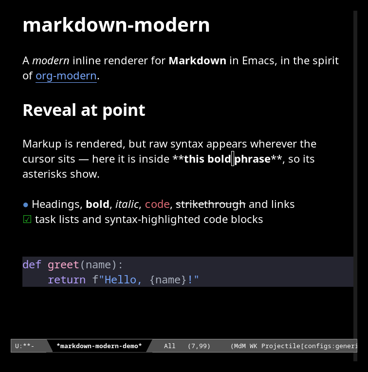

# markdown-modern

Modern visual styling for Markdown buffers in Emacs.



markdown-modern renders Markdown inline — headings, emphasis, code, tables, images — using text properties and overlays, in the spirit of [org-modern](https://github.com/minad/org-modern). It reveals the raw markup of the element under the cursor for editing, rather than showing raw syntax or a split-pane preview.

markdown-modern is a fork of [mark-graf](https://github.com/hyperZphere/mark-graf) by Marc Ansset.

## Features

**markdown-modern's own rendering and editing:**

- **Inline rendering** — headings, bold, italic, inline code, links and images shown in place, via text properties and overlays
- **Reveal-at-point editing** — the element under the cursor shows its raw markup (styling preserved) for editing, and re-renders when you move away; a single view mode, no source/rendered toggle
- **Viewport-driven** — built on `jit-lock`, so rendering cost is independent of file size (see [Performance](#performance))
- **GFM constructs** — tables, task lists, fenced code blocks, strikethrough, blockquotes, lists, horizontal rules
- **Mermaid diagrams** — rendered inline by a built-in, pure-Elisp SVG renderer (no Node or external CLI)
- **LaTeX math** — inline and display math via a built-in LaTeX → Unicode converter
- **HTML export** — built in, with no external dependencies

**Wired up from Emacs built-ins or external tools:**

- **Code-block syntax highlighting** — uses the language's own major mode (`python-mode`, `rust-ts-mode`, …); requires that mode to be installed
- **Inline image display** — Emacs's built-in image support, with scaling
- **SVG math** — optional, via the external `tex2svg` (MathJax-node)
- **PDF / DOCX / other export** — optional, via the external `pandoc`

Keybindings mirror markdown-mode's `C-c C-s …` conventions for familiarity — though markdown-modern is its own major mode (derived from `text-mode`), not built on markdown-mode.

## Performance

Rendering is driven by `jit-lock`, so only the visible region is rendered — open and scroll cost is **independent of file size**, not proportional to it. On a 25,000-line (~600 KB) Markdown file, rendering a screenful takes about **3 ms** with the tree-sitter parser, and reveal-at-point is sub-millisecond. Run `make bench` to measure on your machine.

## Requirements

- Emacs 30.1 or later

### Optional Dependencies

- `pandoc` - For PDF/DOCX export

## Installation

markdown-modern is not on MELPA; install it directly from this repository.

### With `package-vc-install` (Emacs 29+, recommended)

```
M-x package-vc-install RET https://github.com/rjprins/markdown-modern RET
```

Or in your init file:

```elisp
(package-vc-install "https://github.com/rjprins/markdown-modern")
```

With `use-package` (Emacs 30+):

```elisp
(use-package markdown-modern
  :vc (:url "https://github.com/rjprins/markdown-modern"))
```

### Manual

```elisp
(add-to-list 'load-path "/path/to/markdown-modern/lisp")
(require 'markdown-modern)
```

## Usage

Enable markdown-modern for markdown files by adding to your init file:

```elisp
(add-to-list 'auto-mode-alist '("\\.md\\'" . markdown-modern-mode))
```

Or activate manually with `M-x markdown-modern-mode` in any markdown buffer.

### Quick Start

| Key | Command | Description |
|-----|---------|-------------|
| `C-c C-s b` | `markdown-modern-insert-bold` | Insert/toggle **bold** |
| `C-c C-s i` | `markdown-modern-insert-italic` | Insert/toggle *italic* |
| `C-c C-s c` | `markdown-modern-insert-code` | Insert/toggle `code` |
| `C-c C-t 2` | `markdown-modern-insert-heading-2` | Insert ## heading |
| `C-c C-l` | `markdown-modern-insert-link` | Insert link |
| `C-c C-i` | `markdown-modern-insert-image` | Insert image |
| `C-c C-e h` | `markdown-modern-export-html` | Export to HTML |

### Editing Model

markdown-modern has a single view mode. Markdown is always rendered inline; when the
cursor enters the scope of a markup element, that element's raw markup is
revealed so you can edit it in place, and re-rendered once the cursor leaves:

- On a heading line, the `#` markers appear.
- Inside (or right next to) emphasis, a code span, or a link, that element's
  delimiters appear.
- Inside a fenced code block or table, the raw block is shown.

Plain prose is never disturbed, so moving the cursor through ordinary text does
no work. There is no source/rendered toggle to manage.

You can also reveal the element at point on demand with
`markdown-modern-toggle-element-at-point` (`C-c C-v e`).

### Navigation

| Key | Command | Description |
|-----|---------|-------------|
| `C-c C-n` | `markdown-modern-next-heading` | Next heading |
| `C-c C-p` | `markdown-modern-prev-heading` | Previous heading |
| `C-c C-u` | `markdown-modern-up-heading` | Parent heading |
| `TAB` | Context-sensitive | Cycle visibility / table nav |

### Lists

| Key | Command | Description |
|-----|---------|-------------|
| `M-RET` | `markdown-modern-insert-list-item` | New list item |
| `C-c <up/down>` | Move item | Reorder list items |
| `C-c <left/right>` | Promote/demote | Change indentation |
| `C-c C-x C-b` | `markdown-modern-toggle-checkbox` | Toggle task checkbox |

### Tables

| Key | Command | Description |
|-----|---------|-------------|
| `C-c \|` | `markdown-modern-insert-table` | Insert new table |
| `TAB` | `markdown-modern-table-next-cell` | Next cell |
| `S-TAB` | `markdown-modern-table-prev-cell` | Previous cell |

### Export

```elisp
;; Built-in HTML export (no dependencies)
M-x markdown-modern-export-html

;; Preview in browser
M-x markdown-modern-preview-html

;; Export via Pandoc (requires pandoc)
M-x markdown-modern-export-pdf
M-x markdown-modern-export-docx
```

## Customization

All options are under `M-x customize-group RET markdown-modern RET`. The faces
(`markdown-modern-heading-1` … `-6`, `-bold`, `-italic`, `-inline-code`,
`-code-block`, `-table`, …) are under `markdown-modern-faces`.

### Appearance

| Variable | Default | Description |
|----------|---------|-------------|
| `markdown-modern-heading-scale` | `(1.8 1.5 1.3 1.1 1.05 1.0)` | Height scale factors for heading levels 1–6 |
| `markdown-modern-heading-use-variable-pitch` | `t` | Headings use a variable-pitch font |
| `markdown-modern-variable-pitch` | `t` | Enable `variable-pitch-mode` (proportional prose; code/tables stay fixed-pitch) |
| `markdown-modern-visual-line` | `t` | Enable `visual-line-mode` (soft word-wrap) |
| `markdown-modern-left-margin` | `4` | Left margin width, in characters |

### Reading width

| Variable | Default | Description |
|----------|---------|-------------|
| `markdown-modern-manage-text-width` | `nil` | Let markdown-modern constrain the reading width; when `nil` it leaves `fill-column` and wrapping to your config |
| `markdown-modern-text-width` | `90` | Reading width in characters (used only when `manage-text-width` is non-nil) |
| `markdown-modern-table-max-width` | `nil` | Cap rendered table width; `nil` = natural width (scroll over-wide tables with `C-c C-v t`) |

### Code blocks

| Variable | Default | Description |
|----------|---------|-------------|
| `markdown-modern-code-block-syntax-highlight` | `t` | Syntax-highlight code blocks via the language's major mode |
| `markdown-modern-code-block-full-width` | `t` | Extend the code-block background to the window edge |

### Images & diagrams

| Variable | Default | Description |
|----------|---------|-------------|
| `markdown-modern-display-images` | `t` | Display images inline |
| `markdown-modern-image-max-width` | `600` | Maximum inline-image width, in pixels |
| `markdown-modern-image-max-height` | `400` | Maximum inline-image height, in pixels |
| `markdown-modern-cache-directory` | `~/.cache/markdown-modern` | Directory for cached rendered diagrams |

### Math

| Variable | Default | Description |
|----------|---------|-------------|
| `markdown-modern-math-renderer` | `text` | How to render LaTeX math: `text` (Unicode) or `svg` (via tex2svg) |
| `markdown-modern-math-block-scale` | `1.4` | Scale of display-math text relative to normal |
| `markdown-modern-tex2svg-executable` | `"tex2svg"` | Path to `tex2svg` (MathJax-node), for SVG math |

### Export

| Variable | Default | Description |
|----------|---------|-------------|
| `markdown-modern-use-pandoc` | `nil` | Use Pandoc for export when available |
| `markdown-modern-pandoc-executable` | `"pandoc"` | Path to the Pandoc executable |
| `markdown-modern-export-embed-images` | `nil` | Embed images as base64 in HTML export |
| `markdown-modern-export-html-template` | _(built-in)_ | HTML template used by the built-in HTML export |
| `markdown-modern-export-html-css` | _(built-in)_ | CSS used by the built-in HTML export |

### Example configuration

```elisp
(use-package markdown-modern
  :vc (:url "https://github.com/rjprins/markdown-modern")
  :mode ("\\.md\\'" "\\.markdown\\'")
  :custom
  ;; Constrain the reading width (off by default):
  (markdown-modern-manage-text-width t)
  (markdown-modern-text-width 100)
  :config
  (set-face-attribute 'markdown-modern-heading-1 nil :foreground "#2aa198"))
```

## Keybinding Reference

### Style Insertion (C-c C-s prefix)

| Key | Command |
|-----|---------|
| `C-c C-s b` | Bold |
| `C-c C-s i` | Italic |
| `C-c C-s c` | Inline code |
| `C-c C-s s` | Strikethrough |
| `C-c C-s q` | Blockquote |
| `C-c C-s p` | Code block |
| `C-c C-s k` | `<kbd>` tag |

### Headings (C-c C-t prefix)

| Key | Command |
|-----|---------|
| `C-c C-t h` | Insert heading (prompts for level) |
| `C-c C-t 1-6` | Insert heading level 1-6 |
| `C-c C-t !` | Promote heading |
| `C-c C-t @` | Demote heading |

### Reveal (C-c C-v prefix)

| Key | Command |
|-----|---------|
| `C-c C-v e` | Reveal raw markup for the element at point |
| `C-c C-v t` | Toggle horizontal-scroll view (for tables wider than the window) |

### Export (C-c C-e prefix)

| Key | Command |
|-----|---------|
| `C-c C-e h` | Export to HTML |
| `C-c C-e p` | Export to PDF (Pandoc) |
| `C-c C-e d` | Export to DOCX (Pandoc) |
| `C-c C-c p` | Preview in browser |

## Known Limitations

- Setext-style headings (underlines) are not supported
- Math rendering requires external tools for SVG output
- Some complex nested structures may not render perfectly

## License

GPL-3.0-or-later

## Credits

markdown-modern is a fork of [mark-graf](https://github.com/hyperZphere/mark-graf) by Marc Ansset; thanks for the original work.

Inspired by:
- [org-modern](https://github.com/minad/org-modern) - Modern org-mode styling
- [markdown-mode](https://jblevins.org/projects/markdown-mode/) - The standard Emacs markdown mode
