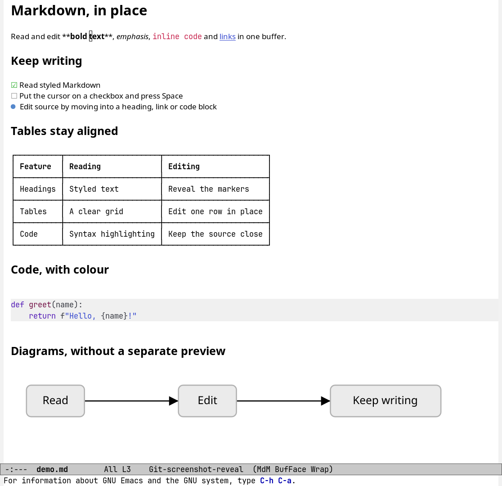

# markdown-modern

[](https://github.com/rjprins/markdown-modern/actions/workflows/ci.yml)

Modern visual styling for Markdown buffers in Emacs.



markdown-modern renders Markdown inline — headings, emphasis, code, tables, images — using text properties and overlays, in the spirit of [org-modern](https://github.com/minad/org-modern). It reveals the raw markup of the element under the cursor for editing, rather than showing raw syntax or a split-pane preview.

markdown-modern is a fork of [mark-graf](https://github.com/hyperZphere/mark-graf) by Marc Ansset.

## Features

**markdown-modern's own rendering and editing:**

- **Inline rendering** — headings, bold, italic, inline code, links and images shown in place, via text properties and overlays
- **Reveal-at-point editing** — the element under the cursor shows its raw markup (styling preserved) for editing, and re-renders when you move away; a single view mode, no source/rendered toggle
- **Viewport-driven** — built on `jit-lock`, so rendering cost is independent of file size (see [Performance](#performance))
- **GFM constructs** — tables, task lists, fenced code blocks, strikethrough, blockquotes, lists, horizontal rules
- **Mermaid diagrams** — rendered inline by a built-in, pure-Elisp SVG renderer (no Node or external CLI)
- **LaTeX math** — inline and display math via a built-in LaTeX → Unicode converter
- **HTML export** — built in, with no external dependencies

**Wired up from Emacs built-ins or external tools:**

- **Code-block syntax highlighting** — uses the language's own major mode (`python-mode`, `rust-ts-mode`, …); requires that mode to be installed
- **Inline image display** — Emacs's built-in image support, with scaling
- **SVG math** — optional, via the external `tex2svg` (MathJax-node)
- **PDF / DOCX / other export** — optional, via the external `pandoc`

Keybindings mirror markdown-mode's `C-c C-s …` conventions for familiarity — though markdown-modern is its own major mode (derived from `text-mode`), not built on markdown-mode.

## Performance

Rendering is driven by `jit-lock`, so only the visible region is rendered — open and scroll cost is **independent of file size**, not proportional to it. On a 25,000-line (~600 KB) Markdown file, rendering a screenful takes about **3 ms** with the tree-sitter parser, and reveal-at-point is sub-millisecond. Run `make bench` to measure on your machine.

## Requirements

- Emacs 30.1 or later

### Optional Dependencies

- `pandoc` - For PDF/DOCX export

## Installation

markdown-modern is not on MELPA; install it directly from this repository.

### With `package-vc-install` (Emacs 30.1+, recommended)

Evaluate this in Emacs, or add it to your init file:

```elisp
(package-vc-install
 '(markdown-modern
   :url "https://github.com/rjprins/markdown-modern"
   :lisp-dir "lisp"))
```

With `use-package` (Emacs 30+):

```elisp
(use-package markdown-modern
  :vc (:url "https://github.com/rjprins/markdown-modern"
       :lisp-dir "lisp")
  :mode ("\\.md\\'" . markdown-modern-mode))
```

`use-package` selects the last release by default. Add `:rev :newest` inside
`:vc` to follow the latest commits. To update an existing VC installation,
run `M-x package-vc-upgrade` and select `markdown-modern`.

### From a release tarball

Download `markdown-modern-VERSION.tar` from the
[GitHub releases](https://github.com/rjprins/markdown-modern/releases).
Run `M-x package-install-file` and select the downloaded file.

### Manual

```elisp
(add-to-list 'load-path "/path/to/markdown-modern/lisp")
(require 'markdown-modern)
```

## Usage

Enable markdown-modern for markdown files by adding to your init file:

```elisp
(add-to-list 'auto-mode-alist '("\\.md\\'" . markdown-modern-mode))
```

Or activate manually with `M-x markdown-modern-mode` in any markdown buffer.

### Tree-sitter setup

The regex parser works without extra libraries. To use tree-sitter, install
both Markdown grammars. Your Emacs build must include tree-sitter support.

```elisp
(require 'markdown-modern)
(setq treesit-language-source-alist
      (append markdown-modern-ts--grammar-sources
              treesit-language-source-alist))
```

Run `M-x treesit-install-language-grammar` once for `markdown` and once for
`markdown-inline`. Then add this to your init file and reopen the buffer:

```elisp
(setq-default markdown-modern-ts--use-tree-sitter t)
```

The switch above is the current internal opt-in setting. If a grammar cannot
be installed, leave it at `nil` to use the regex parser.

### Quick Start

| Key | Command | Description |
|-----|---------|-------------|
| `C-c C-s b` | `markdown-modern-insert-bold` | Insert/toggle **bold** |
| `C-c C-s i` | `markdown-modern-insert-italic` | Insert/toggle *italic* |
| `C-c C-s c` | `markdown-modern-insert-code` | Insert/toggle `code` |
| `C-c C-t 2` | `markdown-modern-insert-heading-2` | Insert ## heading |
| `C-c C-l` | `markdown-modern-insert-link` | Insert link |
| `C-c C-i` | `markdown-modern-insert-image` | Insert image |
| `C-c C-e h` | `markdown-modern-export-html` | Export to HTML |

### Editing Model

markdown-modern has a single view mode. Markdown is always rendered inline; when the
cursor enters the scope of a markup element, that element's raw markup is
revealed so you can edit it in place, and re-rendered once the cursor leaves:

- On a heading line, the `#` markers appear (at the heading's size).
- Inside (or right next to) emphasis, a code span, or a link, that element's
  delimiters appear.
- On a list item or blockquote, the leading marker (`- `, `1. `, `> `) appears.
- Inside a fenced code block, the raw block is shown.
- Inside a table, the table stays a rendered grid: only the row under the cursor
  becomes editable, with its borders kept aligned to the box and re-flowing live
  as you type. The rest of the box stays drawn.

Task checkboxes are the exception: they are treated as interactive widgets, not
markup to reveal. Point on a checkbox keeps the rendered `☐`/`☑`; `SPC` toggles
it, and `Backspace`/`Delete` on it removes the checkbox, leaving a plain list
item.

Plain prose is never disturbed, so moving the cursor through ordinary text does
no work. There is no source/rendered toggle to manage.

You can also reveal the element at point on demand with
`markdown-modern-toggle-element-at-point` (`C-c C-v e`).

### Navigation

| Key | Command | Description |
|-----|---------|-------------|
| `C-c C-n` | `markdown-modern-next-heading` | Next heading |
| `C-c C-p` | `markdown-modern-prev-heading` | Previous heading |
| `C-c C-u` | `markdown-modern-up-heading` | Parent heading |
| `TAB` | Context-sensitive | Cycle visibility / table nav |

### Lists

| Key | Command | Description |
|-----|---------|-------------|
| `M-RET` | `markdown-modern-insert-list-item` | New list item |
| `C-c <up/down>` | Move item | Reorder list items |
| `C-c <left/right>` | Promote/demote | Change indentation |
| `C-c C-x C-b` | `markdown-modern-toggle-checkbox` | Toggle task checkbox |
| `SPC` (on a checkbox) | `markdown-modern-space-or-toggle-checkbox` | Toggle the checkbox under point |
| `Backspace`/`Delete` (on a checkbox) | `markdown-modern-checkbox-delete-{backward,forward}` | Remove the checkbox, keep the list item |

### Tables

Tables render as a box-drawing grid that stays drawn while you edit: the row
under the cursor becomes editable in place, its `│` borders kept pixel-aligned
to the rest of the box and re-flowing live as the cell text grows or shrinks.
Tables are sized to fit the window, so they never wrap the buffer: columns are
narrowed to fit (down to `markdown-modern-table-min-column-width`) and cells
whose content still doesn't fit wrap onto multiple lines. Raise
`markdown-modern-table-max-width` for natural width instead.

| Key | Command | Description |
|-----|---------|-------------|
| `C-c \|` | `markdown-modern-insert-table` | Insert new table |
| `TAB` | `markdown-modern-table-next-cell` | Next cell |
| `S-TAB` | `markdown-modern-table-prev-cell` | Previous cell |

### Export

```elisp
;; Built-in HTML export (no dependencies)
M-x markdown-modern-export-html

;; Preview in browser
M-x markdown-modern-preview-html

;; Export via Pandoc (requires pandoc)
M-x markdown-modern-export-pdf
M-x markdown-modern-export-docx
```

## Customization

All options are under `M-x customize-group RET markdown-modern RET`. The faces
(`markdown-modern-heading-1` … `-6`, `-bold`, `-italic`, `-inline-code`,
`-code-block`, `-table`, …) are under `markdown-modern-faces`.

### Appearance

| Variable | Default | Description |
|----------|---------|-------------|
| `markdown-modern-heading-scale` | `(1.8 1.5 1.3 1.1 1.05 1.0)` | Height scale factors for heading levels 1–6 |
| `markdown-modern-heading-use-variable-pitch` | `t` | Headings use a variable-pitch font |
| `markdown-modern-variable-pitch` | `t` | Enable `variable-pitch-mode` (proportional prose; code/tables stay fixed-pitch) |
| `markdown-modern-visual-line` | `t` | Enable `visual-line-mode` (soft word-wrap) |
| `markdown-modern-left-margin` | `4` | Left margin width, in characters |

### Reading width

| Variable | Default | Description |
|----------|---------|-------------|
| `markdown-modern-manage-text-width` | `nil` | Let markdown-modern constrain the reading width; when `nil` it leaves `fill-column` and wrapping to your config |
| `markdown-modern-text-width` | `90` | Reading width in characters (used only when `manage-text-width` is non-nil) |
| `markdown-modern-table-max-width` | `nil` | Cap rendered table width; `nil` = fit to the window (over-wide columns wrap onto multiple lines so they never wrap the buffer). Set a large number for natural width + horizontal scroll (`C-c C-v t`) |
| `markdown-modern-table-min-column-width` | `8` | Narrowest a column is shrunk to before its content wraps onto multiple lines |
| `markdown-modern-table-max-cell-lines` | `nil` | Max wrapped lines per cell (`nil` = unlimited); content past the cap ends with `…` |
| `markdown-modern-table-ascii-punctuation` | `nil` | Fold wide glyphs (`—`, `→`, `…`, …) to ASCII inside table cells. Enable if your font draws them wider than one monospace cell and misaligns the box |

### Code blocks

| Variable | Default | Description |
|----------|---------|-------------|
| `markdown-modern-code-block-syntax-highlight` | `t` | Syntax-highlight code blocks via the language's major mode |
| `markdown-modern-code-block-full-width` | `t` | Extend the code-block background to the window edge |

### Images & diagrams

| Variable | Default | Description |
|----------|---------|-------------|
| `markdown-modern-display-images` | `t` | Display images inline |
| `markdown-modern-image-max-width` | `600` | Maximum inline-image width, in pixels |
| `markdown-modern-image-max-height` | `400` | Maximum inline-image height, in pixels |
| `markdown-modern-cache-directory` | `~/.cache/markdown-modern` | Directory for cached rendered diagrams |

### Math

| Variable | Default | Description |
|----------|---------|-------------|
| `markdown-modern-math-renderer` | `text` | How to render LaTeX math: `text` (Unicode) or `svg` (via tex2svg) |
| `markdown-modern-math-block-scale` | `1.4` | Scale of display-math text relative to normal |
| `markdown-modern-tex2svg-executable` | `"tex2svg"` | Path to `tex2svg` (MathJax-node), for SVG math |

### Export

| Variable | Default | Description |
|----------|---------|-------------|
| `markdown-modern-use-pandoc` | `nil` | Use Pandoc for export when available |
| `markdown-modern-pandoc-executable` | `"pandoc"` | Path to the Pandoc executable |
| `markdown-modern-export-embed-images` | `nil` | Embed images as base64 in HTML export |
| `markdown-modern-export-html-template` | _(built-in)_ | HTML template used by the built-in HTML export |
| `markdown-modern-export-html-css` | _(built-in)_ | CSS used by the built-in HTML export |

### Example configuration

```elisp
(use-package markdown-modern
  :vc (:url "https://github.com/rjprins/markdown-modern"
       :lisp-dir "lisp")
  :mode ("\\.\\(md\\|markdown\\)\\'" . markdown-modern-mode)
  :custom
  ;; Constrain the reading width (off by default):
  (markdown-modern-manage-text-width t)
  (markdown-modern-text-width 100)
  :config
  (set-face-attribute 'markdown-modern-heading-1 nil :foreground "#2aa198"))
```

## Keybinding Reference

### Style Insertion (C-c C-s prefix)

| Key | Command |
|-----|---------|
| `C-c C-s b` | Bold |
| `C-c C-s i` | Italic |
| `C-c C-s c` | Inline code |
| `C-c C-s s` | Strikethrough |
| `C-c C-s q` | Blockquote |
| `C-c C-s p` | Code block |
| `C-c C-s k` | `<kbd>` tag |

### Headings (C-c C-t prefix)

| Key | Command |
|-----|---------|
| `C-c C-t h` | Insert heading (prompts for level) |
| `C-c C-t 1-6` | Insert heading level 1-6 |
| `C-c C-t !` | Promote heading |
| `C-c C-t @` | Demote heading |

### Reveal (C-c C-v prefix)

| Key | Command |
|-----|---------|
| `C-c C-v e` | Reveal raw markup for the element at point |
| `C-c C-v t` | Toggle horizontal-scroll view (for tables wider than the window) |

### Export (C-c C-e prefix)

| Key | Command |
|-----|---------|
| `C-c C-e h` | Export to HTML |
| `C-c C-e p` | Export to PDF (Pandoc) |
| `C-c C-e d` | Export to DOCX (Pandoc) |
| `C-c C-c p` | Preview in browser |

## Known Limitations

- Setext-style headings (underlines) are not supported
- Math rendering requires external tools for SVG output
- Some complex nested structures may not render perfectly

## Development

Run these commands from the repository root:

```sh
make test          # Run all eight suites
make test-count    # Count tests by suite
make check-syntax  # Fail on byte-compilation warnings
make lint          # Install package-lint locally, then check all libraries
make test-package  # Build, install and load the release tarball
make ci            # Run the complete set of checks
make bench         # Measure rendering speed
```

Lint tools are installed under `.build/`. Tarballs go in `dist/`. Run
`make clean` to remove compiled libraries and tarballs.

CI checks Emacs 30.1 and 31.1 with and without the Markdown grammars. It runs
on pushes, pull requests, manual requests and the first day of each month.
Tests that need grammars are skipped in jobs that check the regex fallback.

### Screenshot

Run `emacs -Q -L lisp -l scripts/screenshot.el` in a graphical session to
render `images/demo.md` and replace `images/screenshot.png`. Review the image
before committing it.

### MELPA recipe

Run `make melpa` to build `recipes/markdown-modern` with MELPA's
`package-build` tool. Run `MELPA_CHANNEL=stable make melpa` to check the
latest release tag. The recipe uses the default file selection, which
includes `lisp/*.el` and excludes tests.

To submit it, copy the recipe into a MELPA checkout, run
`make recipes/markdown-modern`, and open a pull request there. Follow the
[MELPA contribution guide](https://github.com/melpa/melpa/blob/master/CONTRIBUTING.org).
The package is not listed on MELPA until that review is complete.

## License

GPL-3.0-or-later

## Credits

markdown-modern is a fork of [mark-graf](https://github.com/hyperZphere/mark-graf) by Marc Ansset; thanks for the original work.

Inspired by:
- [org-modern](https://github.com/minad/org-modern) - Modern org-mode styling
- [markdown-mode](https://jblevins.org/projects/markdown-mode/) - The standard Emacs markdown mode
